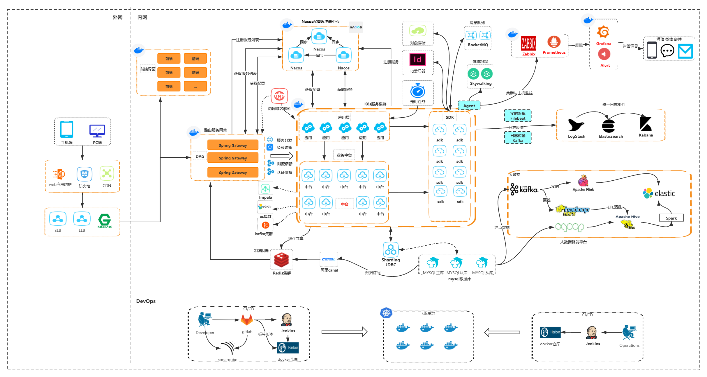

# 解决方案池
## 理想目标  
高可用、高并发、高性能、高拓展、高可靠、易使用、易维护，当然实际情况下并不能达到理想化，往往指标之间还会相互冲突，顾此失彼，此时需要结合公司情况和业务特点做出一定的取舍和妥协，从而给出"最适合"方案  

## 项目价值  
1. 相对通用的项目架构，可作为业务系统基础骨架，适用于大多数互联网分布式架构，可以直接在上面进行业务开发  
2. 各类组件作浅封装，屏蔽一些复杂性，降低各种组件的使用门槛，也为日后的需求拓展、埋点、bug修复等情况做预留，同时，也让业务和具体组件之间解耦，方便更换组件  
3. 封装组件和工具类，希望整个团队能够以相同的方式使用各种组件和工具类，避免每个人对组件、框架、工具类都有自己的一套用法，最终造成滥用，导致难以维护或问题频发  
4. 希望团队的每个人都能对系统架构有个整体的宏观认识，而不单纯是聚焦在如何实现某个功能或者怎么解决某个bug，如果能为大家在日常工作的系统设计上带来一些启发就更好了  
5. 在此基础架构之上不断新增针对不同技术、不同业务场景的解决方案，让整个项目作为技术方案沉淀池，当有业务需要使用到某些方案的时候，可以快速的拿来直接落地使用  

## 项目说明  
1. 相对通用的互联网系统架构，如有比较特殊的业务的需求需要自行根据业务特点来打造，整体上分为 集群运维、监控预警、OLTP、OLAP 四大模块，使用Java作为后端语言，Vue作为前端语言  
2. 后端基础框架使用SpringBoot+Dubbo来实现微服务系统，前端则使用ElemtneUI+Vue实现前后端分离  
3. 功能组件有：RocketMQ、Redis、FastDFS、Zookeeper、Nacos、Quartz、SpringCloudGateway、JavaMail、Elasticsearch 等  
4. 实现的业务功能有：服务注册与发现、配置中心、微服务网关、MQ消息、分布式事务、缓存、限流、熔断、分布式锁、分布式ID、文件存储、定时任务调度、邮件、短信、管理后台、商户后台 等  

## 整体架构规划图
**架构目标**：普适型互联网业务架构
  

## 功能组件  
**消息队列**：封装了 RocketMQ、RabbitMQ、ActiveMQ 三大主流MQ的统一发送端MQSender，开箱即用，降低门槛，如果想更换MQ也不用修改业务代码，
只需修改pom依赖、配置文件和消费端的注解即可，同时，因为做了这一层封装，如果后续有系统监控等需求也方便处理   
**Redis**：封装Redis的客户端，使开发人员不必过于关注其集群模式，同时也为后续的监控埋点等做预留，增加了多数据源的配置，开箱机用  
**Redis分布式锁**：封装好了加锁、释放锁、锁的续租功能，开箱即用  
**Zookeeper分布式锁**：封装好了加锁、释放锁、锁的续租功能，适合对锁的可靠性要求高的场景，开箱即用  
**Elasticsearch**：封装了ES的查询客户端，按sql风格的查询让开发人员不必懂太多ES内容，可以完成常规业务的查询功能，开箱即用  
**FastDFS**：封装FastDFS的客户端，支持tracker server的故障转移和恢复上线，开箱即用  
**Minio**：封装minio的客户端，对象存储，实现文件上传、下载、查询、删除等功能(可替换FastDFS)，可通过文件名实现集群和业务团队定位，方便集群拓展和路由转发，开箱即用  
**Email**：封装邮件发送接口，只需配置Email服务器信息即可实现邮件发送，还支持模板引擎定义邮件内容，简单灵活  
**短信**：对接阿里云sms短信服务,业务开发人员只需配置相关短信模板,然后调用RPC接口进行短信发送即可  
**分布式ID**：以RPC接口的形式提供ID生成器，支持数据库段发号、雪花算法、Redis自增ID，业务开发人员只管调用接口即可，无需过多关心序列号的实现细节和发号效率  
**API网关**：封装了网关层常用功能验签、加签、限流、熔断等功能，集JSON、FORM表单、文件上传为一体，开发人员只需关注业务即可，鉴权限流等由公用功能网关统一提供，支持路由规则热更新  
**定时任务**：以独立服务的形式运行，业务开发人员只需调用接口或者在页面上去添加、暂停、恢复定时任务即可，不用关注实现原理，任务触发之后业务端只需接收消息即可  
**配置中心**：能够实现配置共享、配置实时更新，可施行灰度发布，大大简化对配置文件的管理  
**分库分表**：只需做两样配置即可实现数据库的无限水平拓容：1、配置shardingsphere的相关参数；2、配置各个表的分片规则。因为采用分组+id范围的分片方式，在拓容时无需对旧分片库进行数据迁移  
**统一日志**：通过 starter-logging 可实现日志的统一管理和配置，能做到日志热更新，还能针对特殊日志做邮件预警、持久化到数据库 等处理  
**限流器**：基于Redis的令牌桶限流器RedisTokenLimiter，可用以限流，或者资源监测，当被监测的资源达到限流阈值之后可以做出一些业务处理(如:邮件预警、切换交易通道等)  
**限流熔断**：使用阿里开源的sentinel进行系统限流或者熔断，同时，改造了sentinel-dashboard，能够使用nacos作为持久化存储，拆分出Token Server进行独立部署，
支持服务注册发现，保障Token Server的高可用和水平拓容  

## 服务端组件版本  
**mysql**：          8.0.23  
**activemq**：       5.15.13    
**rocketmq**：       4.8.0  
**rabbitmq**：       3.9.4  
**redis**：          5.0.8  
**zookeeper**：      3.5.9  
**nacos**：          2.0.3  
**sentinel**：       1.8.2  
**elasticsearch**：  7.6.2  
**FastDFS**：        V6.07  
**Minio**：          RELEASE.2021-10-08T23-58-24Z  
**jenkins**：        2.303-1.1  
**gitlab**：         gitlab-ce-13.9.5-ce.0.el7.x86_64  
**kubernetes**：     1.20.8  
**etcd**：           3.5.0  
**docker**：         docker-ce-18.03.0.ce-1.el7.centos  
**harbor**：         harbor-offline-installer-v2.2.3  

## 运维开发(devops)  
**持续部署**：使用 gitlab + jenkins + maven + harbor + k8s 实现CI/CD,几个组件之间的交互已经打通,在pms后台上提供相关页面,实现一键部署上线  
**流量切换**：对接阿里云相关API对域名解析做管理,能够实现不同机房流量的一键切换  
**日志系统**：TODO... ELK搭建  
**监控体系**：TODO... Prometheus + Grafana  

## OLAP体系  
TODO... Canal、Kafka、TiDB、ClickHouse、Elasticsearch、MongoDB、Flink 等

## 规范和约束
#### 服务拆分规则
微服务的拆分主要遵循水平按功能拆分、垂直按业务拆分，服务分类如下：  
1. 基础功能服务，如：定时器服务、消息服务、发号服务等，此类服务不依赖任何其他服务，实现完全自治，保持职责单一、保障运行稳定  
2. 基础业务服务，如：通道对接服务、基础配置服务、账务服务等，此类服务理论上只能依赖基础功能服务  
3. 聚合业务服务，如：商户通知、数据迁移、下单服务、出款服务等，此类服务没有依赖限制，但应避免服务之间的循环依赖  

#### 依赖规约
1. common-statics、xxx-facade 不依赖任何组件(facade可依赖common-statics)，其他组件(尤其是common-xxx的)也应该尽可能减少第三方组件依赖，做到最小引入，避免包冲突引发的一系列问题  
2. common-xxx、xxx-facade 等用以全局共享的模块，打包的时候不能把其依赖包也打包进自己的jar内，避免引起包或者类冲突
3. 任何项目不能依赖其他service的包

#### 其他规约
1. 日常的编码和设计规范可参考《阿里巴巴Java开发手册》
2. service大体分五层设计，dubbo接口暴露层(如：UserFacadeImpl)、biz层、dao层、消息交互层、后台任务层
3. service中的biz层负责业务逻辑和相关事务处理，是最主要的业务功能层，通过dubbo接口暴露层把业务能力暴露出去
4. service中的dao实例只能被biz层注入，避免很多地方都可以调用dao层做数据操作，不利于维护
5. service中的所有相关的数据操作都通过Dao来处理，SqlSessionTemplate、SqlSession 等也只应该出现在dao层，且由各个方法内部管理，禁止作为参数在方法间传递
6. service中需要为每一张数据库表创建对应的Entity实体类(Model层)，但不需要每一张表都需要有一个Biz类，可根据业务特性把多张表的操作逻辑归到同一个Biz中
7. 统一使用starter-plugin下的相关客户端来操作MQ消息发送、redis操作、对象存储、分布式锁等等，方便统一维护，消息传递应使用MsgDto或者其子类
8. 需要在service、web、gateway等系统之间共用的枚举、异常、dto、常量、注解等尽量放在common-statics中，只有自身项目使用到的可以放到当前项目中或者对应的facade中
9. 数据库字段命名统一使用大写，多个单词使用下划线分割，比如：USER_NO，在MyBatisDao中传入驼峰命名格式的排序字段，会自动转换成下划线分割

