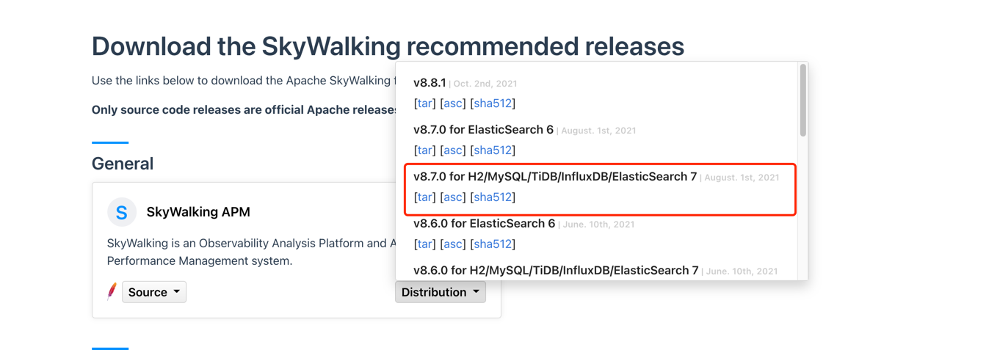

# 本地单机部署简易流程
- **step1：下载**
  地址：https://skywalking.apache.org/downloads/
  （选择v8.7.0 for H2/MySQL/TiDB/InfluxDB/ElasticSearch 7版本）
  
- **step2：启动**
  直接运行安装目录中bin/startup.sh脚本，其中：
  ```
  1、Web UI项目启动端口为：8080(可通过webapp/webapp.yml配置文件更改)，
  2、OAP服务占用端口（可通过config/application.yml配置文件更改）：
  11800 - grpc协议：提供给agent上送数据
  12800 - http协议：提供给UI项目查询数据
  3、默认使用的H2内存级别的存储，重启OAP服务数据即丢失。
  ```

# 应用jvm启动参数配置示例
-javaagent:${skywalking安装路径}/agent/skywalking-agent.jar
-Dskywalking.agent.service_name=demo-skywalking 
-Dskywalking.collector.backend_service=127.0.0.1:11800

设置参数完直接启动应用即可。